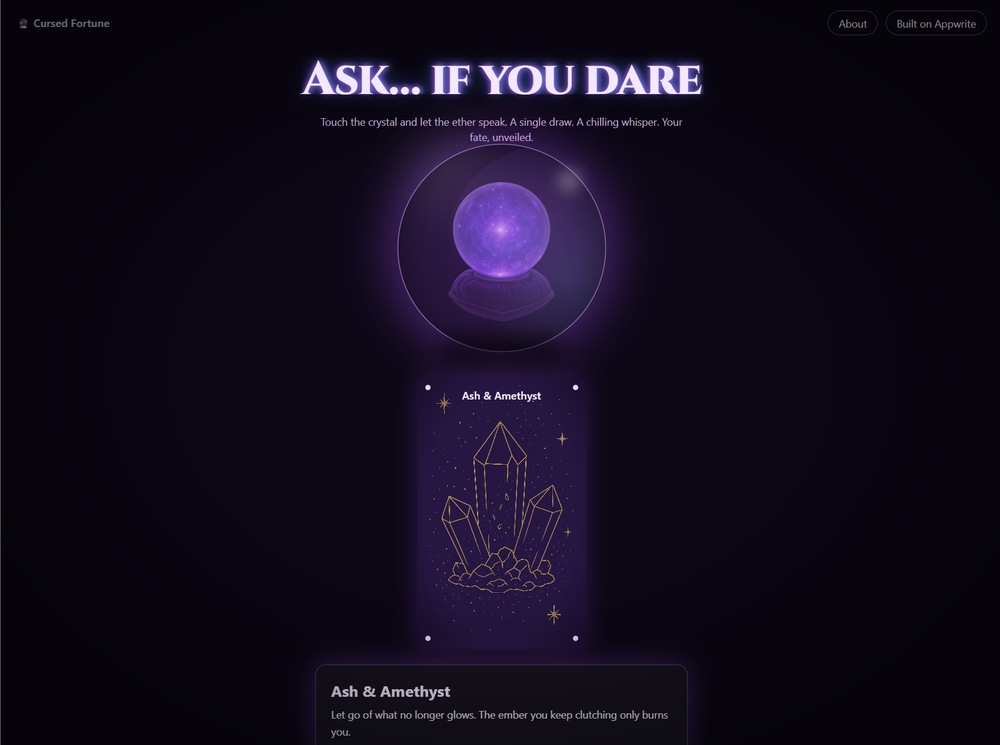

# Cursed Fortune Teller (React + Vite + Tailwind + Appwrite Sites)
🔮 Cursed Fortune Teller

A gothic tarot/fortune web app where you tap a crystal ball to draw a chilling prediction. Built from scratch for the Appwrite Sites hackathon. Deployed as an Appwrite Site with a global CDN, automatic builds, and secure, serverless data.

“The room hushes. The crystal glows. Fate answers…”

✨ Highlights (for judges)

From-scratch build: React + Vite + Tailwind + Appwrite (DB + Sites)

No-repeat shuffle: True deck behavior (shuffles, deals, reshuffles) with session persistence

Instant visuals: Full-bleed tarot art (auto-fallback across .svg/.png/.webp/.jpg)

One-click ambience: Magical chime on draw (toggleable)

Secure & reliable: Public read, controlled write; DDoS-protected hosting via Appwrite

Judge-friendly: Clear setup, live demo, and short explainer

🖼 Demo

Live Site: add your Appwrite Sites URL here

Short Loom/YouTube: add a < 2-min walkthrough link here

Screenshots:


🧩 Tech Stack

Frontend: React + Vite + TypeScript + Tailwind CSS

Data: Appwrite Databases (fortune documents)

Hosting: Appwrite Sites (NYC region)

Audio: HTML5 audio (local asset)

Images: Static under public/cards/* (full-bleed)

## Local dev
```bash
npm i
npm run dev
```
Create `.env` from `.env.example` and fill in your Appwrite IDs.

## Appwrite setup
Collection: `fortunes`
- `title` (string, required)
- `message` (string, required, 512-1024 chars)
- `card` (string, optional - image url or card id)

Grant read permissions to `role:all` for public draws.

## Deploy to Appwrite Sites
- Push to GitHub
- Connect repo in Appwrite Cloud -> Sites
- Build command: `npm run build`
- Output directory: `dist`
